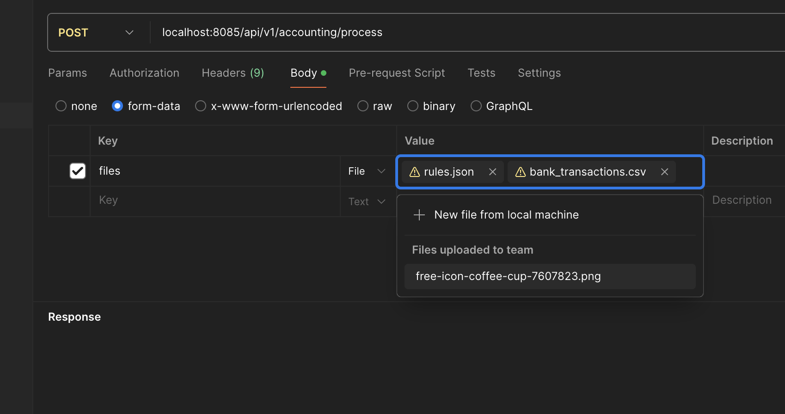

# 설계 및 보안 아키텍쳐 기술서

## A. 시스템 아키텍쳐

### 🍎 기술 스택 : Java, Springboot, docker-compose, postgresql, QueryDSL, JPA
- 언어는 제 메인 스택은 Java, Springboot 기반으로 사용하였습니다. 가장 빠르게 springboot를 기반으로 프로젝트를 구성할 수 있어 사용하였고 기능 구현에 있어 제일 자신있는 언어 이기에 사용하였습니다.
또한 Bean들을 통해 SRP 의 단일 책임 원칙 및 싱글톤을 가장 잘 구현할 수 있는 프레임워크 이기도 하여 선정하였습니다.
- Spring data JPA 는 기본 CRUD를 구현하는데 굉장히 간편해서 사용하였고 QueryDSL은 join query를 좀 더 쉽고 가독성을 좋게 하기 위하여 사용하였습니다.
- DB도 마찬가지로 제가 가장 많이 쓰고 있고 가장 익숙한 DB인 postgresql을 사용하였습니다.
### 🍎 DB: 프로젝트 내 init.sql 참조 부탁드립니다.
- account: 장부 데이터
- company: 회사 데이터
- category: 카테고리 데이터
- keyword: 키워드 데이터
- 관계: company - category - keyword순으로 각각 1:N, 1:N 관계로 구성하였습니다.
- account는 각각 company, category, keyword와 연관관계를 가지며 비즈니스 로직상에서 장부별로 각 데이터를 이 테이블에 매핑시키고 조회는 account 테이블을 통해서 쉽게 조회할 수 있게 만들었습니다.
- 개발 과정에서의 제약이 많아 외래키 제약조건은 생략하였습니다.

### 🍎 아키텍쳐
- 기본적으로 모노리틱 아키텍쳐를 선택하였고 핵심 비즈니스 로직은 주로 불변 객체인 domain 객체로 분류하여 사용하였습니다.
- 또한 단일 책임 원칙을 지키기 위하여 각자의 역할을 가진 class로 분류하여 사용하였습니다.
  - web - controller
  - core - service, domain
  - infrastructure - persistence - repository, entity

## B. 핵심 자동 분류 규칙
### 📖 /api/v1/accounting/process
- 장부데이터(csv), rules.json(규칙) 파일을 파라미터로 받아서 먼저 파일의 유효성 검사 및 파일 형식을 FileValidator라는 기반의 클래스에서 수행합니다.
- 그다음 분류 클래스인 classifyDataService를 통해서 각 파일의 형식에 따라 파일을 분류하고 이 파일들을 읽어 도메인 객체(Account, Policy)로 변환합니다.
- 그다음 thread-safe한 ConcurrentHashMap을 사용해서 내부에 Queue를 구현하여 이 데이터들을 큐에 저장합니다. 이 떄 큐도 똑같이 thread-safe한 BlockingQueue를 사용하여 구현하였습니다.
- 이렇게 사용한 이유로는 지금은 파일의 데이터가 현저히 적지만 데이터가 많아질 경우를 고려하여 읽기와 쓰기를 분리하여 구현하자는 취지입니다.
- Kafka 같은 메세지 큐를 사용할 수도 있지만 오버헤드라고 판단하여 이렇게 구성하였습니다.
- CacheAccountingPolicySetService를 통해 데이터를 메모리에 넣고 AutoFileDataGenerateService를 통해 이 데이터들을 처리합니다.
- 이 과정에서 FileDataGenerator를 통해 장부의 데이터들을 keyword에 해당하는 것들끼리 매칭시킨다음 펼쳐 하나의 객체로 만들었습니다.
- 만약 지금의 분류 과정속에 다른 복잡한 로직이 있다고 가정하고 이 메소드를 호출하는 것을 ExecutorService를 사용하여 비동기로 처리하게 하였습니다.
- 그다음 매칭되있는 객체들을 DB entity 객체로 매핑하여 SaveClassifiedDataService를 통해 DB에 저장되도록 하였습니다.
- 매칭되지 않는 데이터들은 isMatched가 false로 세팅되어 있습니다.
### 📖 /api/v1/accounting/records
- 조회 쪽에서는 기본으로 정리된 account 테이블을 참조하여 쿼리를 작성하였고 이 과정에서 category 테이블의 name 필드가 response 값으로 필요했기 때문에 account 테이블과 category테이블을 join하여 response를 만들었습니다.
- 또한 쿼리 작성은 QueryDSL을 사용하여 작성하였습니다. QueryDSL은 또 하나의 장점으로 Query의 에러를 컴파일 에러로 표시해주기 때문에 시간 효율을 위해 사용한 점도 있습니다.
- RequestParam 으로 companyId 를 보낼시에는 그 companyId에 해당하는 데이터만 내보내고 companyId 생략시에는 전체 데이터를 내보냅니다.
- 응답 필드에 isMatched: true 이면 keyword에 매칭된 항목, false면 매칭되지 않은 데이터 입니다.

## C. 보안 강화 방안
### 🔍접근제어
- 접근제어는 운영 목적인 서비스라면 spring security를 통해 application layer에 접근하는 것을 권한에 따라 적용할 수 있을 것 같습니다.
### 🔑 암호화
- 암호화는 개인정보는 spring security의 hash 알고리즘인 Bcrypt를 사용해서 구현할 것 같고 만약 복호화가 필요하다면 aes 같은 양방향 암호화 알고리즘을 사용해서 개인정보를 암호화할 수 있을 것 같습니다.
- 또한 사용자의 공인인증서를 서버에 저장해야 한다면 만약 linux 서버를 사용한다면 파일 이름도 암호화해서 저장할 수 있을 것 같고 또한 공인인증서를 저장하는 서버를 내부망에 두고 방화벽 정책을 따로 설정할 수 있을 것도 같습니다.
## D. 문제상황 해결책 제시
- 우선적으로 고객사에 문제상황이 발생해서 죄송하다고 말씀드리고 빠르게 복구하겠다고 할 것 같습니다. 
- 이후 빠르게 hotfix 브랜치를 만들고 해당 API 를 차단시켜 잘못된 데이터가 오래 모니터링 되지 않게 빠르게 배포하겠습니다.
- 이후 해당 솔루션의 아키텍쳐가 어떻게 되어있는지 확인하고 문제의 원인이 어디쪽에서 발생했는지 확인할 것 같습니다.
- 데이터가 문제라면 서버 로그 데이터를 기반으로 에러가 발생하지는 않았는지 확인할 것 같고 client 에서 제대로 된 데이터가 올라오고 있는지부터 디버깅 해볼것 같습니다.
### ⚠️ 재발 방지 대책
- 재발 방지 대책으로는 만약 코드적인 오류라면 테스트 코드 혹은 E2E 테스트를 좀 더 강화하여 재발을 막아야 할 것 같습니다.

## ✅ 실행 및 테스트 카이드
- Intellij, docker-compose 미리 설치해야합니다. Java는 17이상 설치해주세요.
1. IDE(intellij) 에서 제 github repo https://github.com/juhoon212/commerce.git 를 pull 받아주세요
2. 프로젝트 내부에 있는 docker-compose.yml 파일을 프로젝트 내부 제일 상위경로에서 ./docker-compose up 명령어로 실행해주세요.
3. 프로젝트 내부에 있는 init.sql 파일을 통해 DB schema및 table을 생성해주세요.
4. 스프링부트 프로젝트를 IDE에서 실행해주세요
4. Postman을 설치하시고 localhost:8085/api/v1/accounting/process로 POST 요청을 보내주세요. 
아래 사진과 같이 multipart/form-data에 key: files, value에 csv, json파일을 넣어서 요청을 보내주세요.

5. /api/v1/accounting/records?companyId=com1 을 postman에서 실행해주세요. companyId를 생략할시 모든 데이터 조회를 조회합니다.

